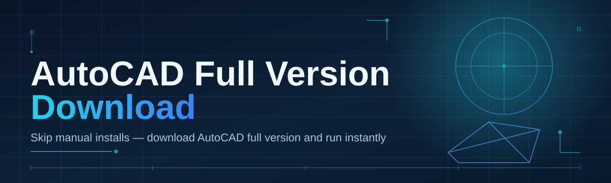

# autocad-full-version-manager 📐🛠️

  

*One weekend, one drafting table full of coffee cups, one manager built to make AutoCAD full version download painless for everyone.*

## 🌱 Overview

**autocad-full-version-manager** started as a scrappy weekend build to solve a problem every drafter, student, and studio has run into at least once: figuring out which AutoCAD build to grab, how to verify it, and how to get it running without wading through a swamp of mismatched mirrors and stale installers. This project is the tidy front-desk for that whole process — a landing page, a changelog, and a small set of tools that keep your AutoCAD full version download organized instead of chaotic.

<strong>📖 The full story (click to expand)</strong>

 

It began as a personal itch. I was helping a friend set up a new workstation for architecture coursework and realized there was no clean, single source of truth for grabbing a full AutoCAD build in 2026 — just scattered forum posts and half-documented mirrors. So over a Saturday and a very tired Sunday, I sketched out a manager: something that tracks versions, verifies checksums, and hands you a clear path from "I need AutoCAD" to "I'm drafting." What you're reading now is that project, grown up a bit, documented properly, and opened to contributors.

This repo isn't a vendor, a reseller, or an activation service — it's a **manager**. Think of it as the calm librarian standing between you and a pile of unsorted installer files. It exists for students spinning up their first CAD workstation, freelance drafters who need a reliable rig fast, and hobbyist tinkerers who just want their AutoCAD full version download to feel less like archaeology and more like a click.

Whether you're on a fresh Windows 11 build or resurrecting an old Windows 10 machine for a side project, this tool aims to make the AutoCAD full version download experience predictable, transparent, and — dare we say — kind of enjoyable.

  

---

## ⚡ What This Little Manager Actually Does

- **Version radar** — keeps a living registry of AutoCAD full version builds so you're never guessing which release is current or compatible with your workflow.

- **Checksum sanity check** — every listed build gets a verification pass so what you download matches what was published, no silent tampering.

- **One-page landing experience** — no maze of buttons, no dark patterns, just a clear path from the README to the actual download.

- **Lightweight local footprint** — the manager itself is a thin shell; it doesn't bloat your system or squat on background processes.

- **Changelog-first mindset** — every release note lives in this README and in the repo history, so you can trace exactly what changed and why.

- **Community-sourced fixes** — troubleshooting notes below come straight from issues filed by real users hitting real installer quirks.

- **Beginner-safe defaults** — sensible out-of-the-box settings so first-time drafters aren't stuck configuring things before they've even opened AutoCAD.

- **No hidden dependencies** — standalone by design; what you see in system requirements is genuinely all you need.

> [!TIP]
> New to the repo? Start with the "How to Get Started" section below, then bookmark the landing page — it's updated whenever a new AutoCAD full version build gets added to the registry.

---

## 🚀 How to Get Started

1. **Visit the landing page** using the download button above — this is the only place the manager links to, so you always know where builds come from.

2. **Download the manager package** for Windows. It's a standalone tool, so there's nothing else to fetch beforehand.

3. **Run the executable** and let it walk you through selecting your AutoCAD full version and target install path.

4. **Launch AutoCAD** once setup completes — you're drafting, modeling, and annotating within minutes, not hours.

> [!NOTE]
> First run may take a little longer while the manager verifies local system compatibility. This is normal and only happens once.

---

## 🖥️ System Requirements

| Requirement | Details |
|---|---|
| **OS** | Windows 10 (64-bit) or Windows 11 |
| **RAM** | 8 GB minimum, 16 GB recommended for large drawings |
| **Disk Space** | 10 GB free for manager + AutoCAD full version install |
| **Dependencies** | None — fully standalone |
| **Graphics** | DirectX 11 capable GPU recommended |
| **Internet** | Required only for initial download from the landing page |

  

> [!IMPORTANT]
> This is a Windows-only tool by design. There are currently no macOS or Linux builds, and none are planned in the near term.

---

## 🧩 How It Works

The manager's workflow is intentionally simple — four honest steps between "I want AutoCAD" and "AutoCAD is open."

1. You land on the project page and pick a version from the registry.

2. The manager fetches the corresponding installer package.

3. A checksum pass confirms the package matches its published fingerprint.

4. The installer runs, and AutoCAD is ready to launch.

---

## 🧯 Troubleshooting

**Q: My AutoCAD full version download stalls partway through — what gives?**
A: This is almost always a flaky connection or a firewall intercepting the transfer. Pause, check your network, and resume from the landing page rather than restarting from zero.

**Q: The manager says the checksum doesn't match. Should I be worried?**
A: Yes — don't proceed. Re-download from the landing page link; a mismatch usually means an interrupted transfer, not something sinister, but it's not worth the risk.

**Q: AutoCAD installs but won't launch on first try.**
A: Reboot once after install. Windows sometimes needs a fresh session to register new drafting-related services properly.

**Q: Can I run multiple AutoCAD versions side by side?**
A: Yes, the manager tracks installs independently, so a 2025 and 2026 build can coexist without stepping on each other.

**Q: My antivirus flagged the installer.**
A: Some antivirus heuristics are twitchy around large CAD installers. Verify the checksum matches what's listed, then whitelist if you're confident in the source.

**Q: Where do I report a bug?**
A: Open an issue in this repo — see the Contributing section below for the friendly version of "please file a report."

---

## 🎨 UI / UX Details

- **Themes**: Light, Dark, and an auto mode that follows your Windows theme setting.

- **Keyboard shortcuts**:
  - `Ctrl + D` — jump straight to the download panel
  - `Ctrl + R` — refresh the version registry
  - `Ctrl + ,` — open settings
  - `Esc` — cancel an in-progress operation

- **Settings panel** lets you pin a default install directory, toggle checksum verbosity, and choose whether the manager checks for registry updates on launch.

- **Progress indicators** are honest — no fake progress bars, actual byte-level tracking during the AutoCAD full version download.

> [!TIP]
> Enable "verbose verification" in settings if you want to see the full checksum comparison log — great for troubleshooting or just satisfying curiosity.

---

## 🤝 Contributing & Community

This project runs on the same energy it was born with: a weekend hobby that got a little bigger than expected, and we'd love your help keeping it that way — friendly, useful, and low-drama.

> [!NOTE]
> Labeled `good-first-issue` tickets are specifically curated for newcomers. No prior CAD tooling experience required — just enthusiasm and a willingness to ask questions.

- Fork the repo, make your change, open a pull request — we review quickly and kindly.
- Found a stale mirror or a version registry error? File an issue, it helps everyone.
- Documentation improvements are just as welcome as code — this README grows with the community.
- Be excellent to each other in issues and PRs. That's the whole code of conduct, really.

---

## 📜 License

Released under the [MIT License](LICENSE), 2026. Use it, fork it, remix it — just keep the license notice intact.

---

## ⚠️ Disclaimer

> [!WARNING]
> This project is an independent, community-built manager and is not affiliated with, endorsed by, or officially connected to Autodesk. "AutoCAD" is a trademark of its respective owner. This tool only organizes and streamlines access to publicly available installer resources via the linked landing page — it does not host, modify, or redistribute proprietary software itself. Always ensure your usage complies with the applicable software license terms.

---

## 🧾 Changelog

<strong>v2026.1.0</strong> — "The Weekend Grew Up"

 

- Rebuilt the version registry UI with clearer build metadata
- Added dark/light/auto theme support
- Introduced verbose checksum verification logging

<strong>v2025.4.2</strong> — "Quiet Fixes"

 

- Fixed stalled downloads not resuming correctly on flaky connections
- Improved error messaging when checksum mismatches occur
- Minor performance improvements to the local manager shell

<strong>v2025.4.0</strong> — "First Real Release"

 

- Initial public version of the manager and landing page
- Basic version registry with three supported AutoCAD builds
- Community issue templates and good-first-issue labeling introduced

  

